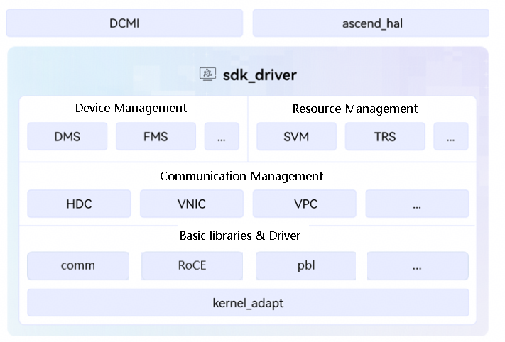

# driver

## Latest News

- **[2026/03] Added support for Ascend A5 chip (PCIE form)**;

- [2025/12] The driver project is released for the first time;

## Overview

The Driver repository code is the driver module of CANN (Compute Architecture for Neural Networks), providing basic driver, resource management, and scheduling capabilities to enable Ascend chips. The current open-source repository mainly contains three parts: DCMI layer (DaVinci Card Management Interface), HAL layer (Hardware Abstraction Layer), and SDK-driver layer (Driver Software Development Kit).

For the position of Driver in the CANN software stack, refer to the description on the [Ascend Community](https://www.hiascend.com/cann).

<center>
    
</center>

## Module Introduction

- [RoCE (RDMA over Converged Ethernet)](./src/ascend_hal/roce/README_en.md): The RoCE module in the Ascend AI processor platform, used to reduce latency and improve data transmission efficiency.
- [SVM (Shared Virtual Memory)](./src/ascend_hal/svm/README_en.md): The memory management module in the Ascend AI processor platform, used to efficiently manage device-side memory.

## Quick Start

If you want to quickly experience driver invocation and development, visit the following documents for quick tutorials.

- [QUICKSTART](./docs/en/QUICKSTART.md): End-to-end quick start guide, including environment setup, compilation and deployment, source code development, debugging, contribution, and other processes.
- [Reference Examples](./examples/README_en.md): Introduction to basic examples for device management and other modules.

## FAQ

- [FAQ](./docs/en/FAQ.md): Summary of source code compilation, installation, deployment, and other issues (continuously updated).

## Directory Structure

The key directory structure is as follows:

```
├── build.sh                                       # Project build script
├── cmake                                          # Build directory
├── CMakeLists.txt                                 # Project CMakeList entry
├── CONTRIBUTING.md                                # Community contribution guide
├── docs                                           # Documentation
├── examples                                       # Interface usage samples
├── pkg_inc                                        # Public header files provided by this repository
├── LICENSES                                       # License directory for this repository
├── OAT.xml                                        # Configuration script for repository tools, used to check license compliance
├── README.md
├── scripts                                        # Script directory for this repository
│   ├── package                                    # Build and packaging scripts
│   ├── ut                                         # UT generation cpp coverage scripts
├── SECURITY.md                                    # Project security statement file
├── Third_Party_Open_Source_Software_Notice        # Third-party open-source software notice for this repository
├── src                                            # Driver package source code
│   ├── ascend_hal                                 # HAL layer source folder
│   │   ├── bbox                                   # Black Box (system final message)
│   │   ├── buff                                   # Inter-process shared memory management
│   │   ├── build                                  # ascend_hal dynamic library build script
│   │   ├── comm                                   # Communication host-side <-> device-side communication layer
│   │   ├── dmc                                    # DMC (Device Maintenance Components) device maintenance component
│   │   │   ├── device_monitor                     # DSMI message path
│   │   │   ├── dsmi                               # DSMI (Device System Manage Interface) device system management interface
│   │   │   ├── logdrv                             # Log
│   │   │   ├── prof                               # Profiling performance collection
│   │   │   └── verify_tool                        # Device-side image verification tool
│   │   ├── dms                                    # DMS (Device Manage System) device management system
│   │   ├── dpa                                    # DPA (Device Public Adapter) device public adapter layer
│   │   ├── dvpp                                   # DVPP (Digital Vision Pre-Processing) digital vision pre-processing module
│   │   ├── esched                                 # Event Schedule
│   │   ├── hdc                                    # Host-Device Communication
│   │   ├── inc                                    # HAL layer internal common header file directory
│   │   ├── mmpa                                   # MMAP (Medium Multiple Platform Adaptive) basic system interface library
│   │   ├── msnpureport                            # Device-side diagnostic information export tool
│   │   ├── pbl                                    # PBL (Public Base Lib) basic public library
│   │   │   ├── uda                                # UDA (Unified Device Access) unified device access
│   │   │   ├── urd                                # URD (User Request Distribute) user request forwarding
│   │   │   ├── commlib                            # Common function library
│   │   │   └── queryfeature                       # Software feature query for compatibility adaptation
│   │   ├── queue                                  # Message queue information management
│   │   ├── roce                                   # RoCE (RDMA over Converged Ethernet)
│   │   ├── svm                                    # Shared Virtual Memory
│   │   └── trs                                    # Task Resource Schedule
│   ├── custom                                     # Customized feature source library
│   │   ├── cmake                                  # CMake build configuration directory
│   │   ├── dev_prod                               # Device customization management directory
│   │   ├── include                                # Public header file export directory
│   │   ├── lqdrv                                  # Lingqu PCIE fault detection
│   │   ├── ndr                                    # NPU RDMA direct pass feature
│   │   ├── network                                # DCMI network interface implementation
│   │   └── ops_debug                              # Operator diagnosis directory
│   └── sdk_driver                                 # SDK layer source folder
│       ├── buff                                   # Inter-process shared memory management
│       ├── comm                                   # Communication host-side <-> device-side communication layer
│       ├── dmc                                    # DMC (Device Maintenance Components) device maintenance component
│       ├── dms                                    # DMS (Device Manage System) device management system
│       ├── dpa                                    # DPA (Device Public Adapter) device public adapter layer
│       ├── esched                                 # Event Schedule
│       ├── fms                                    # FMS (Fault Manage System) fault management system
│       ├── hdc                                    # Host-Device Communication
│   ├── inc                                    # SDK layer internal common header file directory
│       ├── kernel_adapt                           # SDK driver code and kernel source adaptation layer
│       ├── pbl                                    # PBL (Public Base Lib) basic public library
│       ├── platform                               # Chip resource (interrupt, reserved memory, and so on) storage repository
│       ├── queue                                  # Message queue information management
|       ├── seclib                                 # Secure Library
│       ├── svm                                    # Shared Virtual Memory
│       ├── ts_agent                               # TS (Task Schedule) proxy driver source code
│       ├── trsdrv                                 # TRS (Task Resource Schedule) software sqcq communication, mailbox message feature
│       │   ├── trs                                # Task Resource Schedule
│       │   └── trsbase                            # Task Resource Schedule base layer
│       ├── vascend                                # Ascend compute power splitting feature
│       ├── vmng                                   # Virtual Machine Manager
│   ├── vnic                                   # VNIC (Virtual Network Interface Card) virtual network card
│   └── vpc                                    # VPC (Virtual Physical Communication) physical machine and virtual machine communication
└── test                                           # UT test case file directory
```


## Related Information
- [Contributing Guide](./CONTRIBUTING_en.md)
- [Security Statement](./SECURITY_en.md)
- Licenses

&emsp;&emsp;&emsp;[CANN Open Software License Agreement Version 2.0](./LICENSES/CANN-V2.0)

&emsp;&emsp;&emsp;[GNU GENERAL PUBLIC LICENSE Version 2](./LICENSES/GPL-V2.0)