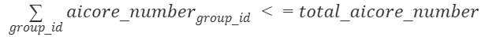

# dcmi\_create\_capability\_group<a name="EN-US_TOPIC_0000002515510450"></a>

**Prototype<a name="section5631123462011"></a>**

**int dcmi\_create\_capability\_group\(int card\_id, int device\_id, int ts\_id, struct dcmi\_capability\_group\_info \*group\_info\)**

**Description<a name="section19632193492013"></a>**

Creates the configuration information of Ascend virtualization instances.

**Parameter Description<a name="section9633113472012"></a>**

<a name="table766115345203"></a>
<table><thead align="left"><tr id="row197331434162017"><th class="cellrowborder" valign="top" width="17.169999999999998%" id="mcps1.1.5.1.1"><p id="p20733143416202"><a name="p20733143416202"></a><a name="p20733143416202"></a>Parameter</p>
</th>
<th class="cellrowborder" valign="top" width="15.15%" id="mcps1.1.5.1.2"><p id="p2733734202019"><a name="p2733734202019"></a><a name="p2733734202019"></a>Input/Output</p>
</th>
<th class="cellrowborder" valign="top" width="17.150000000000002%" id="mcps1.1.5.1.3"><p id="p14733034152020"><a name="p14733034152020"></a><a name="p14733034152020"></a>Type</p>
</th>
<th class="cellrowborder" valign="top" width="50.529999999999994%" id="mcps1.1.5.1.4"><p id="p1173393411206"><a name="p1173393411206"></a><a name="p1173393411206"></a>Description</p>
</th>
</tr>
</thead>
<tbody><tr id="row4733163412208"><td class="cellrowborder" valign="top" width="17.169999999999998%" headers="mcps1.1.5.1.1 "><p id="p13733163432013"><a name="p13733163432013"></a><a name="p13733163432013"></a>card_id</p>
</td>
<td class="cellrowborder" valign="top" width="15.15%" headers="mcps1.1.5.1.2 "><p id="p573323413208"><a name="p573323413208"></a><a name="p573323413208"></a>Input</p>
</td>
<td class="cellrowborder" valign="top" width="17.150000000000002%" headers="mcps1.1.5.1.3 "><p id="p77331534152011"><a name="p77331534152011"></a><a name="p77331534152011"></a>int</p>
</td>
<td class="cellrowborder" valign="top" width="50.529999999999994%" headers="mcps1.1.5.1.4 "><p id="p073313492011"><a name="p073313492011"></a><a name="p073313492011"></a>Device ID. The supported IDs can be obtained by calling <strong id="b173687711533111"><a name="b173687711533111"></a><a name="b173687711533111"></a>dcmi_get_card_list</strong>.</p>
</td>
</tr>
<tr id="row0733113462010"><td class="cellrowborder" valign="top" width="17.169999999999998%" headers="mcps1.1.5.1.1 "><p id="p1073383411207"><a name="p1073383411207"></a><a name="p1073383411207"></a>device_id</p>
</td>
<td class="cellrowborder" valign="top" width="15.15%" headers="mcps1.1.5.1.2 "><p id="p167344341203"><a name="p167344341203"></a><a name="p167344341203"></a>Input</p>
</td>
<td class="cellrowborder" valign="top" width="17.150000000000002%" headers="mcps1.1.5.1.3 "><p id="p1173423420208"><a name="p1173423420208"></a><a name="p1173423420208"></a>int</p>
</td>
<td class="cellrowborder" valign="top" width="50.529999999999994%" headers="mcps1.1.5.1.4 "><p id="p9734103492015"><a name="p9734103492015"></a><a name="p9734103492015"></a>Chip ID, which can be obtained by calling <strong id="b168026096381353"><a name="b168026096381353"></a><a name="b168026096381353"></a>dcmi_get_device_id_in_card</strong>. Value range:</p>
<p id="p0734183415202"><a name="p0734183415202"></a><a name="p0734183415202"></a>NPU: [0, <strong id="b18726919175512"><a name="b18726919175512"></a><a name="b18726919175512"></a>device_id_max</strong> – 1]</p>
<div class="note" id="note102181227171418"><a name="note102181227171418"></a><a name="note102181227171418"></a><span class="notetitle"> NOTE: </span><div class="notebody"><p id="en-us_topic_0000002515350528_p10218227151413"><a name="en-us_topic_0000002515350528_p10218227151413"></a><a name="en-us_topic_0000002515350528_p10218227151413"></a>The value of <strong id="en-us_topic_0000002515350528_b551771083414"><a name="en-us_topic_0000002515350528_b551771083414"></a><a name="en-us_topic_0000002515350528_b551771083414"></a>device_id_max</strong> is <strong id="en-us_topic_0000002515350528_b1263401315345"><a name="en-us_topic_0000002515350528_b1263401315345"></a><a name="en-us_topic_0000002515350528_b1263401315345"></a>2</strong>. A <strong id="en-us_topic_0000002515350528_b544811733415"><a name="en-us_topic_0000002515350528_b544811733415"></a><a name="en-us_topic_0000002515350528_b544811733415"></a>device_id</strong> of <strong id="en-us_topic_0000002515350528_b18565142019343"><a name="en-us_topic_0000002515350528_b18565142019343"></a><a name="en-us_topic_0000002515350528_b18565142019343"></a>0</strong> or <strong id="en-us_topic_0000002515350528_b1255272314342"><a name="en-us_topic_0000002515350528_b1255272314342"></a><a name="en-us_topic_0000002515350528_b1255272314342"></a>1</strong> indicates an NPU. A <strong id="en-us_topic_0000002515350528_b3731133414341"><a name="en-us_topic_0000002515350528_b3731133414341"></a><a name="en-us_topic_0000002515350528_b3731133414341"></a>device_id</strong> of <strong id="en-us_topic_0000002515350528_b174037378345"><a name="en-us_topic_0000002515350528_b174037378345"></a><a name="en-us_topic_0000002515350528_b174037378345"></a>2</strong> indicates an MCU.</p>
</div></div>
</td>
</tr>
<tr id="row1873493415205"><td class="cellrowborder" valign="top" width="17.169999999999998%" headers="mcps1.1.5.1.1 "><p id="p18734173402017"><a name="p18734173402017"></a><a name="p18734173402017"></a>ts_id</p>
</td>
<td class="cellrowborder" valign="top" width="15.15%" headers="mcps1.1.5.1.2 "><p id="p1734143452017"><a name="p1734143452017"></a><a name="p1734143452017"></a>Input</p>
</td>
<td class="cellrowborder" valign="top" width="17.150000000000002%" headers="mcps1.1.5.1.3 "><p id="p187341434172015"><a name="p187341434172015"></a><a name="p187341434172015"></a>int</p>
</td>
<td class="cellrowborder" valign="top" width="50.529999999999994%" headers="mcps1.1.5.1.4 "><p id="p9734113472015"><a name="p9734113472015"></a><a name="p9734113472015"></a>Computing power type ID:</p>
<p id="p1573453410204"><a name="p1573453410204"></a><a name="p1573453410204"></a>typedef enum {</p>
<p id="p273423442020"><a name="p273423442020"></a><a name="p273423442020"></a>DCMI_TS_AICORE = 0,</p>
<p id="p1873453415201"><a name="p1873453415201"></a><a name="p1873453415201"></a>DCMI_TS_AIVECTOR,</p>
<p id="p6734834192015"><a name="p6734834192015"></a><a name="p6734834192015"></a>} DCMI_TS_ID;</p>
<p id="p13734103432012"><a name="p13734103432012"></a><a name="p13734103432012"></a>Currently, <strong id="b1736616330554"><a name="b1736616330554"></a><a name="b1736616330554"></a>DCMI_TS_AIVECTOR</strong> is not supported.</p>
</td>
</tr>
<tr id="row973413418206"><td class="cellrowborder" valign="top" width="17.169999999999998%" headers="mcps1.1.5.1.1 "><p id="p1873443410208"><a name="p1873443410208"></a><a name="p1873443410208"></a>group_info</p>
</td>
<td class="cellrowborder" valign="top" width="15.15%" headers="mcps1.1.5.1.2 "><p id="p073411342202"><a name="p073411342202"></a><a name="p073411342202"></a>Input</p>
</td>
<td class="cellrowborder" valign="top" width="17.150000000000002%" headers="mcps1.1.5.1.3 "><p id="p473412343208"><a name="p473412343208"></a><a name="p473412343208"></a>struct dcmi_capability_group_info *</p>
</td>
<td class="cellrowborder" valign="top" width="50.529999999999994%" headers="mcps1.1.5.1.4 "><p id="p1873415347208"><a name="p1873415347208"></a><a name="p1873415347208"></a>Information about the compute group.</p>
<p id="p67342346202"><a name="p67342346202"></a><a name="p67342346202"></a>The compute capability struct is as follows:</p>
<p id="p97347342201"><a name="p97347342201"></a><a name="p97347342201"></a>#define DCMI_COMPUTE_GROUP_INFO_RES_NUM - AICORE_MASK_NUM 8</p>
<p id="p373473415203"><a name="p373473415203"></a><a name="p373473415203"></a>#define DCMI_AICORE_MASK_NUM 2</p>
<p id="p20734143412020"><a name="p20734143412020"></a><a name="p20734143412020"></a>struct dcmi_capability_group_info {</p>
<p id="p173416342208"><a name="p173416342208"></a><a name="p173416342208"></a>unsigned int  group_id;</p>
<p id="p127345347206"><a name="p127345347206"></a><a name="p127345347206"></a>unsigned int  state;</p>
<p id="p167344343200"><a name="p167344343200"></a><a name="p167344343200"></a>unsigned int  extend_attribute;</p>
<p id="p473413402014"><a name="p473413402014"></a><a name="p473413402014"></a>unsigned int  aicore_number;</p>
<p id="p16734834152014"><a name="p16734834152014"></a><a name="p16734834152014"></a>unsigned int  aivector_number;</p>
<p id="p13734183418205"><a name="p13734183418205"></a><a name="p13734183418205"></a>unsigned int  sdma_number;</p>
<p id="p18734634152016"><a name="p18734634152016"></a><a name="p18734634152016"></a>unsigned int  aicpu_number;</p>
<p id="p167341134162016"><a name="p167341134162016"></a><a name="p167341134162016"></a>unsigned int  active_sq_number;</p>
<p id="p973413492019"><a name="p973413492019"></a><a name="p973413492019"></a>unsigned int  aicore_mask [DCMI_AICORE_MASK_NUM];</p>
<p id="p1673403411209"><a name="p1673403411209"></a><a name="p1673403411209"></a>unsigned int  res[DCMI_COMPUTE_GROUP_INFO_RES_NUM - DCMI_AICORE_MASK_NUM];</p>
<p id="p37345343205"><a name="p37345343205"></a><a name="p37345343205"></a>};</p>
<a name="ul87874572324"></a><a name="ul87874572324"></a><ul id="ul87874572324"><li><strong id="b2481045202111"><a name="b2481045202111"></a><a name="b2481045202111"></a>group_id</strong>: computing power group ID, which is globally unique. The value ranges from 0 to 3. If the value is duplicate, the creation fails.</li></ul>
<a name="ul11464113418334"></a><a name="ul11464113418334"></a><ul id="ul11464113418334"><li><strong id="b248014510569"><a name="b248014510569"></a><a name="b248014510569"></a>state</strong>: creation status of a computing power group. <strong id="b20267135648837"><a name="b20267135648837"></a><a name="b20267135648837"></a>0</strong>: not created. <strong id="b3649097248837"><a name="b3649097248837"></a><a name="b3649097248837"></a>1</strong>: created. When this field is used as an input, it is meaningless.</li><li><strong id="b2068615214571"><a name="b2068615214571"></a><a name="b2068615214571"></a>extend_attribute</strong>: flag of Ascend virtual instances. <strong id="b4686652185718"><a name="b4686652185718"></a><a name="b4686652185718"></a>1</strong>: enabled. Other values indicate that the Ascend virtualization instance is not used as the default group. The default value is <strong id="b1668611521576"><a name="b1668611521576"></a><a name="b1668611521576"></a>0</strong>.</li><li>The value of <strong id="b264915160589"><a name="b264915160589"></a><a name="b264915160589"></a>aicore_number</strong> ranges from 0 to 8, or can be 255. For details, see the following description.</li><li><strong id="b154903240587"><a name="b154903240587"></a><a name="b154903240587"></a>aivector_number</strong>, <strong id="b18491162475817"><a name="b18491162475817"></a><a name="b18491162475817"></a>sdma_number</strong>, <strong id="b1749162445811"><a name="b1749162445811"></a><a name="b1749162445811"></a>aicpu_number</strong> and <strong id="b149262485816"><a name="b149262485816"></a><a name="b149262485816"></a>active_sq_number</strong> can only be set to <strong id="b102826212155"><a name="b102826212155"></a><a name="b102826212155"></a>255</strong>, indicating the remaining available resources, which cannot be partitioned.</li><li><strong id="b20566794648837"><a name="b20566794648837"></a><a name="b20566794648837"></a>aicore_mask</strong>: the mask of the AI Core ID. Each bit indicates a core. <strong id="b15501448068837"><a name="b15501448068837"></a><a name="b15501448068837"></a>1</strong>: AI Core in the computing power group. <strong id="b19214733728837"><a name="b19214733728837"></a><a name="b19214733728837"></a>0</strong>: AI Core not in the computing power group. When this field is used as an input, it is meaningless.</li><li><strong id="b2010794618581"><a name="b2010794618581"></a><a name="b2010794618581"></a>res</strong>: reserved parameter<div class="note" id="note188303923512"><a name="note188303923512"></a><a name="note188303923512"></a><span class="notetitle"> NOTE: </span><div class="notebody"><p id="p653145383518"><a name="p653145383518"></a><a name="p653145383518"></a>Restrictions on <strong id="b14750920158837"><a name="b14750920158837"></a><a name="b14750920158837"></a>group_info</strong>:</p>
<a name="ul34731046183513"></a><a name="ul34731046183513"></a><ul id="ul34731046183513"><li>The value of <strong id="b12714515217"><a name="b12714515217"></a><a name="b12714515217"></a>group_id</strong> ranges from 0 to 3. A newly set <strong id="b162765192110"><a name="b162765192110"></a><a name="b162765192110"></a>group_id</strong> should be unused before; otherwise, a failure message is returned.</li><li>When creating different groups, ensure that the following conditions are met:<ul id="ul97411537203318"><li>&nbsp;</li><li><strong id="b3751335068837"><a name="b3751335068837"></a><a name="b3751335068837"></a>total_aicore_number</strong> is 8.</li><li>When <strong id="b16725885278837"><a name="b16725885278837"></a><a name="b16725885278837"></a>aicore_number</strong> is set to 255, all available cores are occupied by the group. If 255 is configured for multiple groups, these groups share the available cores.</li></ul>
</li></ul>
</div></div>
</li></ul>
</td>
</tr>
</tbody>
</table>

**Return Value<a name="en-us_topic_0000001206627196_en-us_topic_0000001178213188_en-us_topic_0000001146459833_section1256282115569"></a>**

<a name="en-us_topic_0000001819869974_en-us_topic_0000001251227149_en-us_topic_0000001178213202_en-us_topic_0000001097675636_en-us_topic_0000001170223803_table19654399"></a>
<table><thead align="left"><tr id="en-us_topic_0000001819869974_en-us_topic_0000001251227149_en-us_topic_0000001178213202_en-us_topic_0000001097675636_en-us_topic_0000001170223803_en-us_topic_0160151812_row59025204"><th class="cellrowborder" valign="top" width="24.18%" id="mcps1.1.3.1.1"><p id="en-us_topic_0000001819869974_en-us_topic_0000001251227149_en-us_topic_0000001178213202_en-us_topic_0000001097675636_en-us_topic_0000001170223803_en-us_topic_0160151812_p16312252"><a name="en-us_topic_0000001819869974_en-us_topic_0000001251227149_en-us_topic_0000001178213202_en-us_topic_0000001097675636_en-us_topic_0000001170223803_en-us_topic_0160151812_p16312252"></a><a name="en-us_topic_0000001819869974_en-us_topic_0000001251227149_en-us_topic_0000001178213202_en-us_topic_0000001097675636_en-us_topic_0000001170223803_en-us_topic_0160151812_p16312252"></a>Type</p>
</th>
<th class="cellrowborder" valign="top" width="75.82%" id="mcps1.1.3.1.2"><p id="en-us_topic_0000001819869974_en-us_topic_0000001251227149_en-us_topic_0000001178213202_en-us_topic_0000001097675636_en-us_topic_0000001170223803_en-us_topic_0160151812_p46224020"><a name="en-us_topic_0000001819869974_en-us_topic_0000001251227149_en-us_topic_0000001178213202_en-us_topic_0000001097675636_en-us_topic_0000001170223803_en-us_topic_0160151812_p46224020"></a><a name="en-us_topic_0000001819869974_en-us_topic_0000001251227149_en-us_topic_0000001178213202_en-us_topic_0000001097675636_en-us_topic_0000001170223803_en-us_topic_0160151812_p46224020"></a>Description</p>
</th>
</tr>
</thead>
<tbody><tr id="en-us_topic_0000001819869974_en-us_topic_0000001251227149_en-us_topic_0000001178213202_en-us_topic_0000001097675636_en-us_topic_0000001170223803_en-us_topic_0160151812_row13362997"><td class="cellrowborder" valign="top" width="24.18%" headers="mcps1.1.3.1.1 "><p id="en-us_topic_0000001819869974_en-us_topic_0000001251227149_en-us_topic_0000001178213202_en-us_topic_0000001097675636_en-us_topic_0000001170223803_en-us_topic_0160151812_p8661001"><a name="en-us_topic_0000001819869974_en-us_topic_0000001251227149_en-us_topic_0000001178213202_en-us_topic_0000001097675636_en-us_topic_0000001170223803_en-us_topic_0160151812_p8661001"></a><a name="en-us_topic_0000001819869974_en-us_topic_0000001251227149_en-us_topic_0000001178213202_en-us_topic_0000001097675636_en-us_topic_0000001170223803_en-us_topic_0160151812_p8661001"></a>int</p>
</td>
<td class="cellrowborder" valign="top" width="75.82%" headers="mcps1.1.3.1.2 "><p id="en-us_topic_0000001819869974_en-us_topic_0000001251227149_en-us_topic_0000001178213202_en-us_topic_0000001097675636_en-us_topic_0000001170223803_en-us_topic_0160151812_p79561110476"><a name="en-us_topic_0000001819869974_en-us_topic_0000001251227149_en-us_topic_0000001178213202_en-us_topic_0000001097675636_en-us_topic_0000001170223803_en-us_topic_0160151812_p79561110476"></a><a name="en-us_topic_0000001819869974_en-us_topic_0000001251227149_en-us_topic_0000001178213202_en-us_topic_0000001097675636_en-us_topic_0000001170223803_en-us_topic_0160151812_p79561110476"></a>Results:</p>
<a name="en-us_topic_0000001819869974_en-us_topic_0000001251227149_en-us_topic_0000001178213202_en-us_topic_0000001097675636_en-us_topic_0000001170223803_en-us_topic_0160151812_ul55711364478"></a><a name="en-us_topic_0000001819869974_en-us_topic_0000001251227149_en-us_topic_0000001178213202_en-us_topic_0000001097675636_en-us_topic_0000001170223803_en-us_topic_0160151812_ul55711364478"></a><ul id="en-us_topic_0000001819869974_en-us_topic_0000001251227149_en-us_topic_0000001178213202_en-us_topic_0000001097675636_en-us_topic_0000001170223803_en-us_topic_0160151812_ul55711364478"><li>Success: The value <strong id="b13259505077944"><a name="b13259505077944"></a><a name="b13259505077944"></a>0</strong> is returned.</li><li>Failure: For details about the return codes, see <a href="return-codes.md">Return Codes</a>.</li></ul>
</td>
</tr>
</tbody>
</table>

**Exception Handling<a name="en-us_topic_0000001206627196_en-us_topic_0000001178213188_en-us_topic_0000001146459833_toc533412081"></a>**

None

**Restrictions<a name="section3125938142713"></a>**

- This API is used only in open Ctrl CPU form.
- Before making this API call, call the  [dcmi\_get\_capability\_group\_info](dcmi_get_capability_group_info.md)  API to obtain the configured resource information and set inputs in accordance with restrictions on  **ts\_id**  and  **group\_info**. To delete the existing configuration, call the  [dcmi\_delete\_capability\_group](dcmi_delete_capability_group.md)  API.

**Table  1** Support in different deployment scenarios

<a name="table6183194116432"></a>
<table><thead align="left"><tr id="en-us_topic_0000002515350556_en-us_topic_0000001820029662_en-us_topic_0000001251227155_en-us_topic_0000001178213210_en-us_topic_0000001147728951_row119194469302"><th class="cellrowborder" rowspan="2" valign="top" id="mcps1.2.5.1.1"><p id="en-us_topic_0000002515350556_en-us_topic_0000001820029662_p974813717495"><a name="en-us_topic_0000002515350556_en-us_topic_0000001820029662_p974813717495"></a><a name="en-us_topic_0000002515350556_en-us_topic_0000001820029662_p974813717495"></a>Product Model</p>
</th>
<th class="cellrowborder" colspan="2" valign="top" id="mcps1.2.5.1.2"><p id="en-us_topic_0000002515350556_p114288580415"><a name="en-us_topic_0000002515350556_p114288580415"></a><a name="en-us_topic_0000002515350556_p114288580415"></a>PM (Bare Metal)</p>
</th>
<th class="cellrowborder" valign="top" id="mcps1.2.5.1.3"><p id="en-us_topic_0000002515350556_en-us_topic_0000001820029662_en-us_topic_0000001206627196_en-us_topic_0000001178213188_en-us_topic_0000001146459833_p992084633012"><a name="en-us_topic_0000002515350556_en-us_topic_0000001820029662_en-us_topic_0000001206627196_en-us_topic_0000001178213188_en-us_topic_0000001146459833_p992084633012"></a><a name="en-us_topic_0000002515350556_en-us_topic_0000001820029662_en-us_topic_0000001206627196_en-us_topic_0000001178213188_en-us_topic_0000001146459833_p992084633012"></a>PM + Unprivileged Container</p>
</th>
</tr>
<tr id="en-us_topic_0000002515350556_en-us_topic_0000001820029662_row19216056194814"><th class="cellrowborder" valign="top" id="mcps1.2.5.2.1"><p id="en-us_topic_0000002515350556_en-us_topic_0000001820029662_en-us_topic_0000001251227155_en-us_topic_0000001178213210_en-us_topic_0000001147728951_p792013462306"><a name="en-us_topic_0000002515350556_en-us_topic_0000001820029662_en-us_topic_0000001251227155_en-us_topic_0000001178213210_en-us_topic_0000001147728951_p792013462306"></a><a name="en-us_topic_0000002515350556_en-us_topic_0000001820029662_en-us_topic_0000001251227155_en-us_topic_0000001178213210_en-us_topic_0000001147728951_p792013462306"></a>Root User</p>
</th>
<th class="cellrowborder" valign="top" id="mcps1.2.5.2.2"><p id="en-us_topic_0000002515350556_en-us_topic_0000001820029662_en-us_topic_0000001251227155_en-us_topic_0000001178213210_en-us_topic_0000001147728951_p16920346133016"><a name="en-us_topic_0000002515350556_en-us_topic_0000001820029662_en-us_topic_0000001251227155_en-us_topic_0000001178213210_en-us_topic_0000001147728951_p16920346133016"></a><a name="en-us_topic_0000002515350556_en-us_topic_0000001820029662_en-us_topic_0000001251227155_en-us_topic_0000001178213210_en-us_topic_0000001147728951_p16920346133016"></a>Running User Group (Non-root User)</p>
</th>
<th class="cellrowborder" valign="top" id="mcps1.2.5.2.3"><p id="en-us_topic_0000002515350556_en-us_topic_0000001820029662_en-us_topic_0000001251227155_en-us_topic_0000001178213210_en-us_topic_0000001147728951_p166440421324"><a name="en-us_topic_0000002515350556_en-us_topic_0000001820029662_en-us_topic_0000001251227155_en-us_topic_0000001178213210_en-us_topic_0000001147728951_p166440421324"></a><a name="en-us_topic_0000002515350556_en-us_topic_0000001820029662_en-us_topic_0000001251227155_en-us_topic_0000001178213210_en-us_topic_0000001147728951_p166440421324"></a>Root User</p>
</th>
</tr>
</thead>
<tbody><tr id="en-us_topic_0000002515350556_en-us_topic_0000001820029662_en-us_topic_0000001251227155_en-us_topic_0000001178213210_en-us_topic_0000001147728951_row18920204653019"><td class="cellrowborder" valign="top" width="25%" headers="mcps1.2.5.1.1 mcps1.2.5.2.1 "><p id="en-us_topic_0000002515350556_en-us_topic_0000001820029662_en-us_topic_0000001819869974_p1378374019445"><a name="en-us_topic_0000002515350556_en-us_topic_0000001820029662_en-us_topic_0000001819869974_p1378374019445"></a><a name="en-us_topic_0000002515350556_en-us_topic_0000001820029662_en-us_topic_0000001819869974_p1378374019445"></a><span id="en-us_topic_0000002515350556_en-us_topic_0000001820029662_en-us_topic_0000001819869974_text262011415447"><a name="en-us_topic_0000002515350556_en-us_topic_0000001820029662_en-us_topic_0000001819869974_text262011415447"></a><a name="en-us_topic_0000002515350556_en-us_topic_0000001820029662_en-us_topic_0000001819869974_text262011415447"></a><span id="en-us_topic_0000002515350556_text1564782665814"><a name="en-us_topic_0000002515350556_text1564782665814"></a><a name="en-us_topic_0000002515350556_text1564782665814"></a>Atlas 900 A3 SuperPoD</span></span></p>
</td>
<td class="cellrowborder" valign="top" width="25%" headers="mcps1.2.5.1.2 mcps1.2.5.2.2 "><p id="en-us_topic_0000002515350556_en-us_topic_0000001820029662_p11683124944919"><a name="en-us_topic_0000002515350556_en-us_topic_0000001820029662_p11683124944919"></a><a name="en-us_topic_0000002515350556_en-us_topic_0000001820029662_p11683124944919"></a>N</p>
</td>
<td class="cellrowborder" valign="top" width="25%" headers="mcps1.2.5.1.2 mcps1.2.5.2.3 "><p id="en-us_topic_0000002515350556_en-us_topic_0000001820029662_p36831949194913"><a name="en-us_topic_0000002515350556_en-us_topic_0000001820029662_p36831949194913"></a><a name="en-us_topic_0000002515350556_en-us_topic_0000001820029662_p36831949194913"></a>N</p>
</td>
<td class="cellrowborder" valign="top" width="25%" headers="mcps1.2.5.1.3 "><p id="en-us_topic_0000002515350556_en-us_topic_0000001820029662_p2683144919499"><a name="en-us_topic_0000002515350556_en-us_topic_0000001820029662_p2683144919499"></a><a name="en-us_topic_0000002515350556_en-us_topic_0000001820029662_p2683144919499"></a>N</p>
</td>
</tr>
<tr id="en-us_topic_0000002515350556_en-us_topic_0000001820029662_en-us_topic_0000001251227155_en-us_topic_0000001178213210_en-us_topic_0000001147728951_row82952324359"><td class="cellrowborder" valign="top" width="25%" headers="mcps1.2.5.1.1 mcps1.2.5.2.1 "><p id="en-us_topic_0000002515350556_en-us_topic_0000001820029662_en-us_topic_0000001819869974_p137832403444"><a name="en-us_topic_0000002515350556_en-us_topic_0000001820029662_en-us_topic_0000001819869974_p137832403444"></a><a name="en-us_topic_0000002515350556_en-us_topic_0000001820029662_en-us_topic_0000001819869974_p137832403444"></a><span id="en-us_topic_0000002515350556_en-us_topic_0000001820029662_en-us_topic_0000001819869974_text6814122411310"><a name="en-us_topic_0000002515350556_en-us_topic_0000001820029662_en-us_topic_0000001819869974_text6814122411310"></a><a name="en-us_topic_0000002515350556_en-us_topic_0000001820029662_en-us_topic_0000001819869974_text6814122411310"></a><span id="en-us_topic_0000002515350556_text1123515513517"><a name="en-us_topic_0000002515350556_text1123515513517"></a><a name="en-us_topic_0000002515350556_text1123515513517"></a>Atlas 9000 A3 SuperPoD Cluster Computing System</span></span></p>
</td>
<td class="cellrowborder" valign="top" width="25%" headers="mcps1.2.5.1.2 mcps1.2.5.2.2 "><p id="en-us_topic_0000002515350556_en-us_topic_0000001820029662_en-us_topic_0000001251227155_en-us_topic_0000001178213210_en-us_topic_0000001147728951_p1285753073419"><a name="en-us_topic_0000002515350556_en-us_topic_0000001820029662_en-us_topic_0000001251227155_en-us_topic_0000001178213210_en-us_topic_0000001147728951_p1285753073419"></a><a name="en-us_topic_0000002515350556_en-us_topic_0000001820029662_en-us_topic_0000001251227155_en-us_topic_0000001178213210_en-us_topic_0000001147728951_p1285753073419"></a>N</p>
</td>
<td class="cellrowborder" valign="top" width="25%" headers="mcps1.2.5.1.2 mcps1.2.5.2.3 "><p id="en-us_topic_0000002515350556_en-us_topic_0000001820029662_en-us_topic_0000001251227155_en-us_topic_0000001178213210_en-us_topic_0000001147728951_p1985743013346"><a name="en-us_topic_0000002515350556_en-us_topic_0000001820029662_en-us_topic_0000001251227155_en-us_topic_0000001178213210_en-us_topic_0000001147728951_p1985743013346"></a><a name="en-us_topic_0000002515350556_en-us_topic_0000001820029662_en-us_topic_0000001251227155_en-us_topic_0000001178213210_en-us_topic_0000001147728951_p1985743013346"></a>N</p>
</td>
<td class="cellrowborder" valign="top" width="25%" headers="mcps1.2.5.1.3 "><p id="en-us_topic_0000002515350556_en-us_topic_0000001820029662_en-us_topic_0000001251227155_en-us_topic_0000001178213210_en-us_topic_0000001147728951_p0857203013412"><a name="en-us_topic_0000002515350556_en-us_topic_0000001820029662_en-us_topic_0000001251227155_en-us_topic_0000001178213210_en-us_topic_0000001147728951_p0857203013412"></a><a name="en-us_topic_0000002515350556_en-us_topic_0000001820029662_en-us_topic_0000001251227155_en-us_topic_0000001178213210_en-us_topic_0000001147728951_p0857203013412"></a>N</p>
</td>
</tr>
<tr id="en-us_topic_0000002515350556_row12693311552"><td class="cellrowborder" valign="top" width="25%" headers="mcps1.2.5.1.1 mcps1.2.5.2.1 "><p id="en-us_topic_0000002515350556_p17872181618166"><a name="en-us_topic_0000002515350556_p17872181618166"></a><a name="en-us_topic_0000002515350556_p17872181618166"></a><span id="en-us_topic_0000002515350556_text17872121641614"><a name="en-us_topic_0000002515350556_text17872121641614"></a><a name="en-us_topic_0000002515350556_text17872121641614"></a>Atlas 800T A3 SuperPoD</span></p>
</td>
<td class="cellrowborder" valign="top" width="25%" headers="mcps1.2.5.1.2 mcps1.2.5.2.2 "><p id="en-us_topic_0000002515350556_p177521042115520"><a name="en-us_topic_0000002515350556_p177521042115520"></a><a name="en-us_topic_0000002515350556_p177521042115520"></a>N</p>
</td>
<td class="cellrowborder" valign="top" width="25%" headers="mcps1.2.5.1.2 mcps1.2.5.2.3 "><p id="en-us_topic_0000002515350556_p12752114215559"><a name="en-us_topic_0000002515350556_p12752114215559"></a><a name="en-us_topic_0000002515350556_p12752114215559"></a>N</p>
</td>
<td class="cellrowborder" valign="top" width="25%" headers="mcps1.2.5.1.3 "><p id="en-us_topic_0000002515350556_p18752104275512"><a name="en-us_topic_0000002515350556_p18752104275512"></a><a name="en-us_topic_0000002515350556_p18752104275512"></a>N</p>
</td>
</tr>
<tr id="en-us_topic_0000002515350556_row179407221298"><td class="cellrowborder" valign="top" width="25%" headers="mcps1.2.5.1.1 mcps1.2.5.2.1 "><p id="en-us_topic_0000002515350556_p696322918294"><a name="en-us_topic_0000002515350556_p696322918294"></a><a name="en-us_topic_0000002515350556_p696322918294"></a><span id="en-us_topic_0000002515350556_text15963162972914"><a name="en-us_topic_0000002515350556_text15963162972914"></a><a name="en-us_topic_0000002515350556_text15963162972914"></a>Atlas 800I A3 SuperPoD</span></p>
</td>
<td class="cellrowborder" valign="top" width="25%" headers="mcps1.2.5.1.2 mcps1.2.5.2.2 "><p id="en-us_topic_0000002515350556_p1560813335296"><a name="en-us_topic_0000002515350556_p1560813335296"></a><a name="en-us_topic_0000002515350556_p1560813335296"></a>N</p>
</td>
<td class="cellrowborder" valign="top" width="25%" headers="mcps1.2.5.1.2 mcps1.2.5.2.3 "><p id="en-us_topic_0000002515350556_p260873392918"><a name="en-us_topic_0000002515350556_p260873392918"></a><a name="en-us_topic_0000002515350556_p260873392918"></a>N</p>
</td>
<td class="cellrowborder" valign="top" width="25%" headers="mcps1.2.5.1.3 "><p id="en-us_topic_0000002515350556_p5608333162914"><a name="en-us_topic_0000002515350556_p5608333162914"></a><a name="en-us_topic_0000002515350556_p5608333162914"></a>N</p>
</td>
</tr>
<tr id="en-us_topic_0000002515350556_row19346183355516"><td class="cellrowborder" valign="top" width="25%" headers="mcps1.2.5.1.1 mcps1.2.5.2.1 "><p id="en-us_topic_0000002515350556_p0905133713551"><a name="en-us_topic_0000002515350556_p0905133713551"></a><a name="en-us_topic_0000002515350556_p0905133713551"></a><span id="en-us_topic_0000002515350556_text1190563775520"><a name="en-us_topic_0000002515350556_text1190563775520"></a><a name="en-us_topic_0000002515350556_text1190563775520"></a>A200T A3 Box8 SuperPoD server</span></p>
</td>
<td class="cellrowborder" valign="top" width="25%" headers="mcps1.2.5.1.2 mcps1.2.5.2.2 "><p id="en-us_topic_0000002515350556_p7204194395516"><a name="en-us_topic_0000002515350556_p7204194395516"></a><a name="en-us_topic_0000002515350556_p7204194395516"></a>N</p>
</td>
<td class="cellrowborder" valign="top" width="25%" headers="mcps1.2.5.1.2 mcps1.2.5.2.3 "><p id="en-us_topic_0000002515350556_p13205104310553"><a name="en-us_topic_0000002515350556_p13205104310553"></a><a name="en-us_topic_0000002515350556_p13205104310553"></a>N</p>
</td>
<td class="cellrowborder" valign="top" width="25%" headers="mcps1.2.5.1.3 "><p id="en-us_topic_0000002515350556_p32051943125519"><a name="en-us_topic_0000002515350556_p32051943125519"></a><a name="en-us_topic_0000002515350556_p32051943125519"></a>N</p>
</td>
</tr>
<tr id="en-us_topic_0000002515350556_row1158213431480"><td class="cellrowborder" colspan="4" valign="top" headers="mcps1.2.5.1.1 mcps1.2.5.1.2 mcps1.2.5.1.3 mcps1.2.5.2.1 mcps1.2.5.2.2 mcps1.2.5.2.3 "><p id="en-us_topic_0000002515350556_p65418471681"><a name="en-us_topic_0000002515350556_p65418471681"></a><a name="en-us_topic_0000002515350556_p65418471681"></a>Note: <strong id="en-us_topic_0000002515350556_en-us_topic_0000002515350556_b130904228481512"><a name="en-us_topic_0000002515350556_en-us_topic_0000002515350556_b130904228481512"></a><a name="en-us_topic_0000002515350556_en-us_topic_0000002515350556_b130904228481512"></a>Y</strong> indicates that the function is supported, <strong id="en-us_topic_0000002515350556_en-us_topic_0000002515350556_b200767006881512"><a name="en-us_topic_0000002515350556_en-us_topic_0000002515350556_b200767006881512"></a><a name="en-us_topic_0000002515350556_en-us_topic_0000002515350556_b200767006881512"></a>N</strong> indicates that the function is not supported, and <strong id="en-us_topic_0000002515350556_en-us_topic_0000002515350556_b90682012381512"><a name="en-us_topic_0000002515350556_en-us_topic_0000002515350556_b90682012381512"></a><a name="en-us_topic_0000002515350556_en-us_topic_0000002515350556_b90682012381512"></a>NA</strong> indicates that the function is not involved and planned currently.</p>
</td>
</tr>
</tbody>
</table>

**Example<a name="section206582034172018"></a>**

```c
...
int ret = 0;
int card_id = 0;
int dev_id = 0;
int ts_id = 0;
struct dcmi_capability_group_info group_info = {0};
group_info.group_id = 0;
group_info.aivector_number = 255;
group_info.sdma_number = 255;
group_info.aicpu_number = 255;
group_info.active_sq_number = 255;
group_info.aicore_number = 8;
 
ret = dcmi_create_capability_group(card_id, dev_id, ts_id, &group_info);
if (ret != 0){
    // todo: Record logs.
    return ret;
}
...
```
