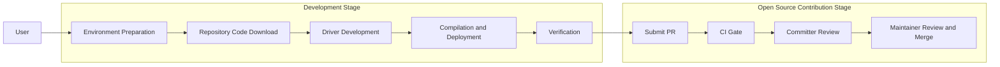

# Quick Start

This guide helps you quickly get started with using the driver repository. The driver development and contribution process is shown in the following diagram. We welcome and encourage you to contribute to the community and enrich the project ecosystem together.



# Directory Guide

1.&emsp;***[Environment Deployment and Compilation Build](#environment-deployment-and-compilation-build)***: Set up the development and runtime environment, compile the source code, and deploy the installation.

2.&emsp;***[Debugging and Verification](#debugging-and-verification)***: Guidance on viewing and setting logs during development and runtime.

3.&emsp;***[Development Guide](#development-guide)***: Custom driver development guide to learn how to develop, compile, and verify code from scratch.

# <h2 id="environment-deployment-and-compilation-build">I. Environment Deployment and Compilation Build</h2>

## 1. Compilation Environment Preparation

Driver supports source code compilation. Before source code compilation, complete the relevant environment preparation according to the following steps.

Driver source code compilation requires the following dependent software:

   - gcc
   - cmake
   - bash
   - kernel-headers
   - net-tools
   - openssl development library
   - pkg-config
   - patch
   - googletest (optional, required only for UT testing, recommended version [release-1.11.0](https://github.com/google/googletest/releases/tag/release-1.11.0))
   - makeself (required for local compilation of run package, [download link](https://github.com/megastep/makeself))

  <br/>
   If not installed, obtain and install from the corresponding operating system vendor website based on the Linux distribution version used.
  <br/>
  <br/>

```bash
# Example for openEuler environment:
yum install -y tar net-tools kernel-headers-$(uname -r) kernel-devel-$(uname -r) openssl-devel pkg-config patch
yum install -y gcc gcc-c++ g++ cmake make libffi libffi-devel binutils binutils-devel elfutils elfutils-devel elfutils-libelf-devel
```

```bash
# Example for Ubuntu environment:
apt install -y tar net-tools linux-headers-$(uname -r) gcc g++ cmake make libffi-dev libssl-dev pkg-config patch
```

## 2. Source Code Download

Execute the following command to download the Driver repository source code:

```
git clone https://gitcode.com/cann/driver.git
```

## 3. Source Code Compilation and Deployment

Compilation depends on open-source third-party libraries and Driver open-source binary libraries. After starting compilation, they are automatically downloaded. Ensure network connectivity.
Recommended OS versions are Linux v5.4, Linux v5.10, or Linux v6.8.
<p style="line-height:1.5;">
(1) Execute source code compilation as follows:

```
bash build.sh --pkg --soc=${chip_type}
```

`${chip_type}` indicates the chip type, currently including `ascend910b`, `ascend910_93`, and `ascend950`.

After compilation completes, the `Ascend-hdk-<chip_type>-driver-<version>_<os_version>-<arch>.run` software package is generated in the `build_out` directory.

Notes:

a. Before executing this compilation command repeatedly, manually clean the files generated from the previous compilation to avoid cache issues.

```bash
# Clean command
bash build.sh --make_clean
```

</p>

b. ascend950 supports compilation in the ARM environment of the Lingqu Computing System Super Node Architecture. Before source code compilation, complete the following additional environment preparation:

- The compilation environment requires `openEuler 24.03 LTS SP4` system
- Install ube related dependency packages

    ```
    yum install -y umdk-urma-lib umdk-urma-devel libummu-devel
    ```

- Add `--ube` to the compilation parameter
    The reference command is as follows:

    ```
    bash build.sh --pkg --soc=ascend950 --ube
    ```

<p style="line-height:1.5;">
(2) Deployment and Installation:

Execute the following command to install the Driver package:

```
./Ascend-hdk-<chip_type>-driver-<version>_<os_version>-<arch>.run --full
```

`<chip_type>` indicates the chip type, currently including `910b`, `A3`, and `950`. `<version>` indicates the software package version number, for example 8.5.0. `<os_version>` indicates the operating system distribution version, for example Ubuntu20.04, openEuler22.03. `<arch>` indicates the chip architecture, with values including x86_64 and aarch64.

After installation completes, the Driver software package compiled by the user replaces the Driver-related software in the installed CANN development kit package.

If you need to install the firmware package, obtain the firmware package for the matched hardware product from the [Ascend official website](https://www.hiascend.com/hardware/firmware-drivers/commercial) and install it according to the matched version [Installation Guide](https://hiascend.com/document/redirect/CannCommunityInstSoftware). After selecting the installation scenario, see the "Installing NPU Driver and Firmware" section.
</p>

## 4. Other Functions

For more compilation parameters, view them through `bash build.sh -h`.

## 5. Software Package Uninstallation

Uninstall according to the matched version [Uninstallation Guide](https://hiascend.com/document/redirect/CannCommunityInstSoftware). After selecting the installation guide, see the "Uninstallation" section.

# <h2 id="debugging-and-verification">II. Debugging and Verification</h2>

During development, if you encounter program debugging problems, first check the user-mode logs generated by the application on the Host side (hereinafter referred to as application logs), then check the kernel-mode logs on the Host side through "dmesg" or system log files. If the problem cannot be located, use the msnpureport tool to export more detailed Device side logs (hereinafter referred to as system logs).

The default logging level for application logs and system logs is "ERROR". If "ERROR" level logs are insufficient for problem location, set a more detailed log level (such as "DEBUG") for in-depth analysis.

## 1. Log Viewing

- **View application logs**: Refer to the matched version [Log Reference](https://hiascend.com/document/redirect/CANNCommunitylogreflevel). Get detailed instructions in the "Viewing Application Logs" section.

- **View Host side kernel logs**:

    - To view "ERROR" level logs, execute the following command:

        ```
        dmesg
        ```

        Or check "/var/log/messages" or "/var/log/syslog" based on the operating system.

    - To view "INFO", "WARNING", "EVENT" level logs generated during runtime, execute the following command to export logs:

        ```
        /usr/local/Ascend/driver/tools/msnpureport -f
        ```

        After execution, a directory named with a timestamp is generated. The log file is located at: "./timestamp/slog/host/host_kernel.log".

- **View system logs**: Refer to the matched version [Log Reference](https://hiascend.com/document/redirect/CANNCommunitylogreflevel). Get detailed instructions in the "Viewing System Logs" section.

## 2. Log Settings

- **Application log level settings**: Refer to the [Log Reference](https://hiascend.com/document/redirect/CANNCommunitylogreflevel). Get configuration methods in the "Setting Application Log Level" section.

- **System log level settings**: Refer to the [Log Reference](https://hiascend.com/document/redirect/CANNCommunitylogreflevel). Get configuration methods in the "Setting System Log Level" section.

# <h2 id="development-guide">III. Development Guide</h2>

The purpose of this stage is to become familiar with driver development by adding new interfaces in the driver code. Here, adding a DCMI interface is used as an example.

## 1. Modify Driver Code

Add a new dsmi interface in the `driver/src/ascend_hal/dmc/dsmi/dsmi_common/dsmi_common_interface.c` file with the following code:

```
int dsmi_get_host_device_connect_type(int device_id, unsigned int *connect_type)
{
    int ret;
    struct devdrv_device_info dev_info = { 0 };

    if (connect_type == NULL) {
        return DRV_ERROR_INVALID_VALUE;
    }

    /* drvGetDevInfo: Get NPU device information */
    ret = drvGetDevInfo((unsigned int)device_id, &dev_info);
    if (ret == (int)DRV_ERROR_RESOURCE_OCCUPIED) {
        return DRV_ERROR_RESOURCE_OCCUPIED;
    }

    *connect_type = dev_info.host_device_connect_type;
    return 0;
}
```

Also add the interface declaration in the `driver/pkg_inc/dsmi_common_interface.h` file.

```
/**
* @ingroup driver
* @brief host-device connect types
* @attention null
* @param [in]  device_id  device id
* @param [out] connect_type  host-device connect types
* @return  0 for success, others for fail
*/
int dsmi_get_host_device_connect_type(int device_id, unsigned int *connect_type);
```

Add a new dcmi interface in the `driver/src/custom/dev_prod/user/dcmi/dcmi_interface/src/dcmi_basic_info_intf.c` file with the following code:

```
int dcmi_get_host_device_connect_type(int device_id, unsigned int *connect_type)
    {
        int ret;
    
        if (dcmi_get_run_env_init_flag() != TRUE) {
            gplog(LOG_ERR, "not init.");
            return DCMI_ERR_CODE_NOT_REDAY;
        }
    
        if ((connect_type == NULL) || (device_id < 0)) {
            gplog(LOG_ERR, "para is invalid");
            return DCMI_ERR_CODE_INVALID_PARAMETER;
        }
    
        ret = dsmi_get_host_device_connect_type(device_id, connect_type);
        if (ret != DCMI_OK) {
            gplog(LOG_ERR, "call dsmi_get_host_device_connect_type failed. err is %d.", ret);
            return ret;
        }
    
        return DCMI_OK;
    }
```

## 2. Compile and Update Driver Package

Refer to steps 1-2 of the [Environment Deployment and Compilation Build](#environment-deployment-and-compilation-build) section to recompile and install the driver package.

## 3. Verification

## 4. Execution Results
