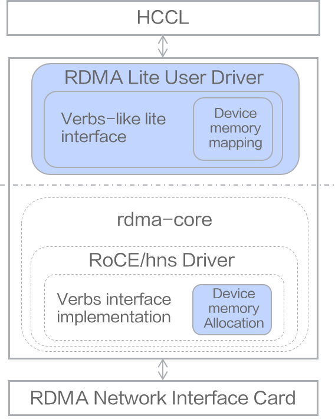

# RoCE

## Overview

RoCE (RDMA over Converged Ethernet) is implemented based on the [rdma-core](https://github.com/linux-rdma/rdma-core) open-source framework. The main customized features include:

- Control plane encapsulates corresponding lite interfaces for verbs, mapping Device memory to Host memory, supporting context reconstruction on the Host side.
- Data plane encapsulates corresponding lite interfaces for verbs, enabling direct data plane operations on the Host side based on reconstructed context, improving WR (Work Request) submission and CQ (Complete Queue) polling performance.

## Feature Framework

    

- The highlighted parts in the feature framework correspond to the code in the driver repository, including the following two parts:
    - RDMA Lite user-space driver: `src/ascend_hal/roce/host_lite/`
    - Device memory allocation: `src/ascend_hal/roce/roce_hal_api/`

- Application in the system

    For example, calling `rdma_lite_post_send(lite_qp, lite_send_wr, &lite_send_bad_wr, attr, &resp);` to submit WR, you can submit WR on the Host side to directly write WR into the Device-side queue.

    

- Application scenario example

    Upper-layer collective communication libraries achieve more advanced collective communication operators (for example, allgather and so on) by combining WR submissions, such as submitting RDMA Write operations.