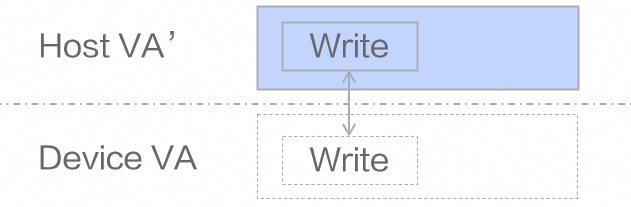

# RoCE

## 🚀Overview

RoCE (RDMA over Converged Ethernet) main customization features implemented based on [rdma-core](https://github.com/linux-rdma/rdma-core) open-source framework:

- Control plane encapsulates corresponding verbs lite interfaces, mapping Device memory to Host memory, supporting rebuilding corresponding context on Host side.
- Data plane encapsulates corresponding verbs lite interfaces, can directly issue data plane operations on Host side based on rebuilt context, improving WR (Work Request) issuance and CQ (Complete Queue) polling performance.

## 📝Functional Framework

    

- Highlighted parts in functional framework correspond to driver repository code, containing two parts:
    - RDMA Lite user-mode driver: `src/ascend_hal/roce/host_lite/`
    - Device memory allocation: `src/ascend_hal/roce/roce_hal_api/`

- Application in System

    For example, calling: `rdma_lite_post_send(lite_qp, lite_send_wr, &lite_send_bad_wr, attr, &resp);` to issue WR, can issue WR on Host side to achieve directly writing WR to Device side queue purpose.

    

- Application Scenario Example

    Upper layer collective communication library issues WR through combination, such as issuing RDMA Write operations, thereby implementing more advanced collective communication operators (for example: allgather, and so on).
