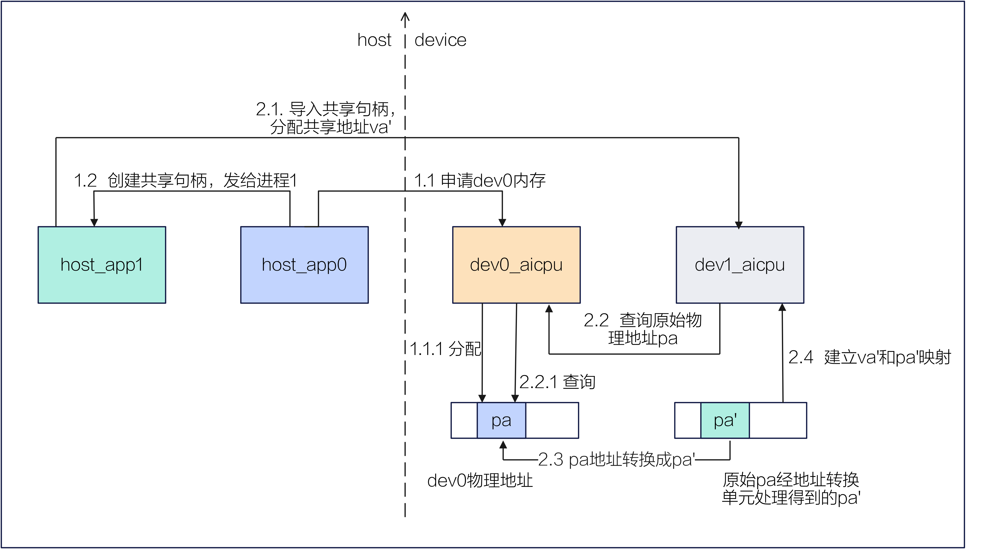
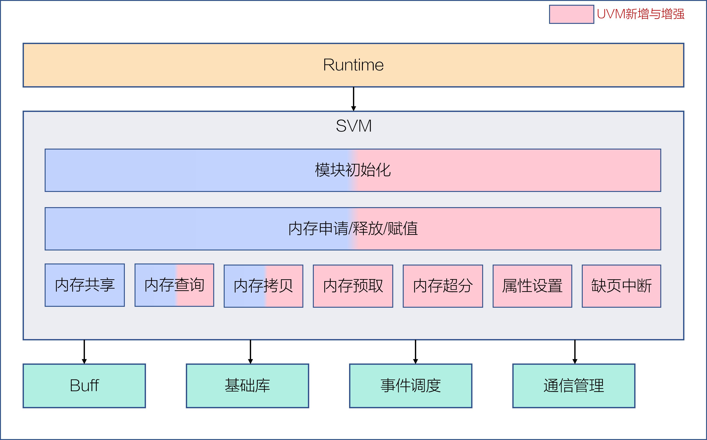
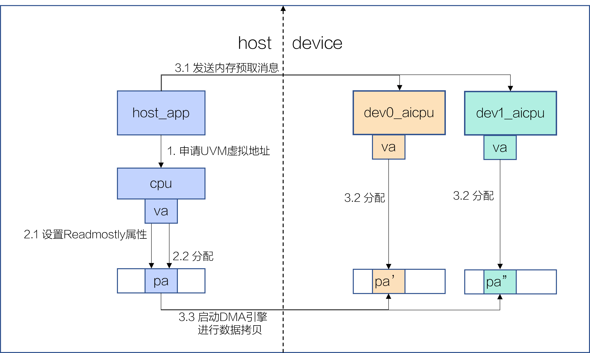
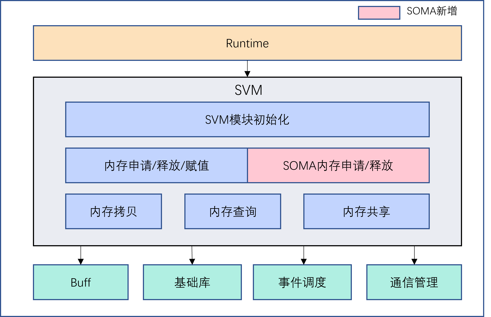
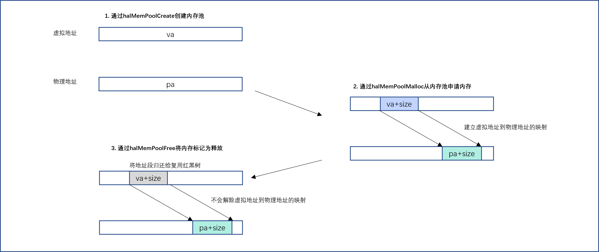

# SVM

## 整体介绍

SVM (Shared Virtual Memory) 是昇腾 AI 处理器平台中的内存管理模块，用于高效管理设备侧内存。其主要功能包括内存的初始化、申请、释放、拷贝、查询和共享等，并向上层模块（如 Runtime）提供 HAL 接口。

<center>
    
</center>

## SVM 初始化

SVM 接口 ：```halMemAgentOpen```
<br/>
APP 进程在初始化时会调用上层业务的初始化接口 ```aclrtSetDevice```，其中包含 SVM 模块的初始化流程。该流程主要包括：初始化 SVM 的模块管理结构体，并完成 Host 侧与 Device 侧 SVM 模块之间的交互。

## 内存申请/释放/赋值

SVM 接口：```halMemAlloc```/```halMemFree```/```drvMemsetD8```
<br/>
从预留的虚拟地址范围内分配并映射（通过 ```mmap```）一段虚拟地址，同时进入内核态申请物理页，并建立相应的页表项。释放时，则依次解除页表映射、释放物理页，并将虚拟地址归还至预留范围。内存赋值将指定大小的设备内存设置为给定的值。

此外，驱动还提供了 VMM 接口，允许开发者分别申请虚拟地址和物理地址，并根据需要动态建立它们之间的映射关系。
<br/>

- VMM 虚拟地址申请/释放
<br/>

SVM 接口 ：```halMemAddressReserve```/```halMemAddressFree```
<br/>
从预留的地址范围内分配并映射（通过 ```mmap```）一段虚拟地址，此时尚未真正分配物理页；释放时仅回收该虚拟地址。

- VMM 物理地址申请/释放
<br/>

SVM 接口 ：```halMemCreate```/```halMemRelease```
<br/>
在设备侧分配指定属性和大小的物理内存，并返回一个不透明的通用内存分配句柄，作为后续内存映射的引用标识；释放时，则释放该句柄所对应的物理内存。

- VMM 映射/解映射虚拟地址到物理地址
<br/>

SVM 接口 ：```halMemMap```/```halMemUnmap```
<br/>
建立或解除传入的虚拟地址与物理地址之间的映射关系。

## 内存查询

内存查询支持指定地址的内存属性查询和内存信息查询。

- 内存属性查询
<br/>

SVM 接口 ：```drvMemGetAttribute```
<br/>
获取传入虚拟地址的内存属性、物理页粒度等属性。

- 内存信息查询
<br/>

SVM 接口 ：```halMemGetInfo```
<br/>
查询设备侧的物理内存信息。

## 内存拷贝

SVM 接口 ：```halMemcpy```
<br/>
支持在主机与设备之间，或不同设备间进行内存数据传输。例如，在执行 H2D（Host-to-Device）传输时，会将数据从主机内存同步拷贝到设备内存。该同步拷贝操作是阻塞式的——调用方会一直等待，直到全部数据拷贝完成，才会返回并继续执行后续代码。

## 内存共享

内存共享支持不同设备间的内存共享，以及主机（Host）与设备（Device）之间的内存共享。

- 设备间内存共享
<br/>

SVM 接口 ：
```halShmemCreateHandle```/```halShmemDestroyHandle```
<br/>
```halShmemOpenHandleByDevId```/```halShmemCloseHandle```
<br/>
进程 1 创建一个指向共享设备内存的句柄；进程 2 通过解析该句柄，将其映射为本进程内的设备内存地址，从而实现对设备侧同一块物理内存的共享访问。销毁句柄和解除映射则分别执行相应的反向操作。

- host 和 device 间内存共享
<br/>

SVM 接口 ：```halHostRegister```/```halHostUnregister```
<br/>
将对端（Host 侧或 Device 侧）的内存对应注册到本端（Device 侧或 Host 侧），使本端能够直接访问或修改对端内存中的数据。

## SVM 在业务中的使用流程

#### 申请拷贝功能的业务使用流程

- 应用场景
<br/>

在算子运行前，其 Host 侧进程需先初始化 SVM 模块，然后调用 ```halMemAlloc``` 接口分别申请 Host 内存和 Device 内存，并获取对应的内存地址；随后，通过内存拷贝接口将待计算的数据从 Host 侧传输至 Device 侧。

- 业务调用 SVM 接口流程

1. 调用 ```halMemAlloc``` 接口申请 Host 内存，获取 Host 内存地址。
2. 调用 ```halMemAlloc``` 接口申请 Device 内存，获取 Device 内存地址。
3. 调用 ```halMemcpy``` 接口，将数据从 Host 内存同步拷贝至 Device 内存，完成数据搬运。

<center>
    
</center>

#### 内存共享功能的业务使用流程

- 应用场景
<br/>

业务模块在 Host 侧启动两个应用进程：host_app 进程 0 和 host_app 进程 1，分别对应设备 dev0 和 dev1。
<br/>
在算子执行过程中，dev0 将已完成的计算结果写入其本地设备内存。若后续计算需由 dev1 执行，则 dev1 可通过上述共享内存机制直接访问 dev0 的运算结果，无需经过 Host 中转或显式的数据拷贝，从而显著提升算子流水线的执行效率。

- 业务调用 SVM 接口流程

1. host_app 进程 0 调用 ```halMemAlloc``` 申请 dev0 上的设备内存，并通过 ```halShmemCreateHandle``` 接口创建该内存的共享句柄，随后将该句柄传递给 host_app 进程 1。
2. host_app 进程 1 调用驱动接口 ```halShmemOpenHandleByDevId``` 打开该共享句柄，驱动返回指向共享内存的指针，从而完成对 dev0 内存的映射。

<center>
    
</center>

#### VMM 功能的业务使用流程

- 应用场景
<br/>

基于 VMM 功能，业务模块可一次性申请所需的虚拟地址和物理地址，并根据实际需求动态建立映射关系，重复使用同一块物理内存，从而有效减少因物理内存频繁切分而导致的内存碎片。

- 业务调用 SVM 接口流程
<br/>

1. 调用```halMemAddressReserve```申请虚拟地址。
2. 调用```halMemCreate```申请物理地址。
3. 调用```halMemMap```建立虚拟地址到物理地址的映射。

<center>
    
</center>

# UVM

## 整体介绍

UVM（Unified Virtual Memory）是昇腾 AI 处理器的内存管理组件，作为原 SVM 模块的功能增强，旨在构建跨主机端与设备端的统一地址空间，支持透明的内存分配与释放逻辑。

其核心设计原则在于屏蔽物理存储介质的差异性：用户程序仅需维护单一的虚拟地址视图，系统根据访问模式实现数据在 DDR（Double Data Rate）与 HBM（High Bandwidth Memory）间的自动或半自动平滑迁移，并支持零拷贝直接访问。

UVM主要聚焦以下三个功能点：

- 易用性：CPU 和 NPU 可以直接访问统一内存，无需手动调用内存拷贝接口。
- 支持卡侧内存超分：通过冷热识别和内存换出机制，突破单卡物理内存限制，使单个 NPU 能够处理超大规模数据集。
- 高性能：支持提前异步预取数据到需要目标设备，将数据访问和传输任务重叠，实现流水线并行。

<center>
    
</center>

## 使用限制
当前只支持Ascend910B/Ascend910\_93硬件形态。

## 内存申请释放

UVM 接口：halMemAlloc/halMemFree

内存申请和释放接口复用 SVM 接口实现 UVM 统一虚拟地址管理，核心流程如下：

调用 halMemAlloc 时配合 MEM_UVM 标志，表示申请 UVM 内存。

- 延迟分配：系统仅预留虚拟地址空间，不立即触发物理页分配。
- 按需寻址：物理内存的申请推迟至首次读写访问。此时通过硬件触发 Page Fault，内核动态分配物理页（支持大页）并建立页表映射。
- 资源回收：调用 halMemFree 同步释放虚拟地址与物理地址，并取消关联的页表映射，刷新 TLB（Translation Lookaside Buffer）。

## 内存属性设置

UVM 接口：halMemManagedAdvise 

支持设置或者取消一段 UVM 内存段的特定属性，以优化数据布局：

- READ_MOSTLY：设置内存多副本属性，通常称为 read mostly 属性，适合读多写少场景。该属性通过在 Host 侧和多个 Device 侧同时创建只读副本（虚拟地址共享多个物理副本），旨在减少缺页中断引起的性能开销。其优势在于除首次访问外，各对象访问均无需重新建立映射；但代价较高，一旦发生写操作，除写对象外的所有副本将失效并取消该属性。默认情况下，设置此项会忽略 location 参数并在 Host 侧建立初始副本。
- UNSET_READ_MOSTLY：取消多副本属性。系统仅保留 location 指定位置的副本（若 location 无效则默认保留 Host 侧副本），并释放其他位置的物理内存。
- PREFER_LOCATION：设置内存首选位置属性，通常称为 preferred location 属性，表示访问该内存段内存的首选位置是 Host 侧或 Device 侧，用于提前分配物理内存并建立页表映射，从而避免运行时缺页中断。
在设置preferred location属性时，需要注意 read mostly 属性是否被设置：
  - read mostly 属性未设置时：若在首选位置已有映射则直接返回；若在非首选位置已有映射则返回报错；若都没有映射则申请物理内存、建立 readwrite 属性的页表映射后再返回。
  - read mostly 属性已设置时：若将首选位置设置在 Host 侧，则接口内部无需操作直接返回；若将首选位置设置在某个指定的 Device 侧，则接口内部会检查指定 Device 侧是否有副本，如果有，则直接返回，如果没有，则建立只读副本后再返回。
- UNSET_PREFER_LOCATION：取消设置 preferred location 位置。
- ACCESS_BY_LOCATION：设置远端映射属性，通常称为 access by 属性，建立远端映射，暗示指定设备将访问该段内存。该属性需与首选位置属性配合使用：当两者指定的 location 相同时，系统会提前申请物理内存，建立页表映射，从而避免在首选位置访问内存时出现缺页中断的开销。（注：目前A2/A3架构不支持建立远端映射）。
- UNSET_ACCESS_BY_LOCATION：取消设置 access by 属性。

## 缺页中断

UVM 统一虚拟内存的核心功能是基于页中断的按需迁移。当 CPU 或者 NPU 访问未映射或者权限受限的虚拟地址时，系统触发缺页中断，通过数据搬运、页表重建及副本一致性维护，实现跨设备的地址空间统一。

- Host 侧缺页中断处理：包括未映射地址访问导致的缺页，以及在 readmostly 场景下对 Host 侧页面的写入操作。
- Device 侧缺页中断处理：包括对未映射地址访问导致的缺页，以及在 readmostly 场景下对 Device 页面的写入操作。

## 内存超分

UVM 支持 Device 侧内存超分以应对内存 OOM（Out of Memory）风险，通过将非活跃页面置换至 Host 侧，实现逻辑内存容量的扩展。该机制包含两部分：

- 冷热识别：
    - 硬件标识：利用页表项中的 Young Bit 标志位。当 AI CPU 或 AI Core 访问对应的页面时，硬件自动将该位置置为1。
    - 软件扫描：Device 侧内核态监测线程定期对UVM内存页表项的 Young Bit 执行读后清零操作，实现内存页的冷热识别。
    - 动态分级：结合预设的内存水位线，系统在不同水位压力下动态调整扫描频率与热度阈值，实现差异化的超分策略。

- 内存换出：通过 DMA（Direct Memory Access） 引擎将识别出的冷数据从 Device 侧迁移至预分配的 Host 侧映射区，释放 Device 侧内存。

## 内存数据预取

UVM 接口：halMemManagedPrefetch

显示将数据预取到目标设备：

- 减少性能抖动：避免 Device 侧因触发大量缺页中断而导致严重的性能抖动。
- 流水线并行：结合 Runtime 层实现异步预取接口。在 Device 侧处理当前批次数据的同时，异步预取下一批次数据。
- 批量传输：相比逐页搬运，大块数据的异步预取能更好地跑满 PCie 或者 UB 带宽。

## UVM在业务中使用流程

#### 内存预取功能的业务使用流程

- 应用场景
<br/>

基于 UVM 功能，针对读多写少的场景，比如需要将大模型的权重参数传输到多张卡上做并行推理任务，业务模块可申请所需的虚拟地址，设置 Readmostly 属性，Host 侧申请物理内存并建立映射，通过内存预取将数据传输到 Device 侧。

- 业务调用 UVM 接口流程
<br/>

1. 调用 ```halMemAlloc``` 接口申请 Host 侧虚拟内存，获取 Host 侧虚拟内存地址。
2. 调用 ```halMemManagedAdvise``` 接口设置 READ_MOSTLY 属性，申请物理内存并建立页表映射。
3. 调用 ```halMemManagedPrefetch``` 接口触发预取任务，将数据从 Host 侧迁移到 Device 侧。

- UVM 接口调用流程实现用例
<br/>

[UVM 测试文件](../../../examples/resmng/uvm/developer_demo/uvm_main.c)
<br/>
业务流程测试函数：st_uvm_test_002

<center>
    
</center>

# SOMA
## 整体介绍
SOMA (Stream-Oriented Memory Allocator) 是 SVM（Shared Virtual Memory）模块下的流式异步内存管理子模块，用于面向流（Stream）执行场景高效管理设备侧内存资源。其主要功能包括内存池的创建与销毁、异步内存申请与释放、内存池属性设置与查询等，并向上层模块（如 Runtime）提供高性能、低开销的异步内存管理能力。
<center>
    
</center>

## 使用限制
- SOMA特性无法通过主机侧调用 HAL 接口使能，只能通过 Runtime ACL 接口使能，使用样例参考[SOMA Runtime example](https://gitcode.com/cann/runtime/blob/master/example/3_memory_advanced/memory_pool)。
- 当前只支持Ascend950 PCIE硬件形态。

## 内存池创建销毁
SOMA 接口：`halMemPoolCreate` / `halMemPoolDestroy`  

通过 `halMemPoolCreate` 可以在设备上创建一个内存池管理结构，用于管理后续的异步内存申请和释放。内存池创建时可以设置内存池的id、内存池的最大容量等，但不会立即分配物理内存。  

通过 `halMemPoolDestroy` 可以销毁指定的内存池管理结构，确保所有由该池分配的内存块被正确释放，并将相关资源归还给系统，从而避免内存泄漏。

## 异步内存申请/释放
SOMA 接口：`halMemPoolMalloc` / `halMemPoolFree`  

`halMemPoolMalloc` 是 device 侧提供给 AI CPU 调用的内存申请接口，用于从指定内存池中申请一段设备内存。调用时需要指定目标内存池、虚拟地址、申请大小以及内存申请策略。函数会根据内存池管理结构分配物理页，并建立对应的页表映射，使申请得到的内存可以直接用于后续计算。

`halMemPoolFree` 用于将一段设备内存归还到内存池。调用时需要指定目标内存池、虚拟地址、释放大小以及释放策略。释放后的内存不会立即归还给操作系统，而是保留在内存池中等待后续复用，从而提高内存利用率和分配效率。

## 内存池属性设置与查询
SOMA 接口：`halMemPoolSetAttr` / `halMemPoolGetAttr`  

通过 `halMemPoolSetAttr` 可以设置内存池的属性，如内存池水线值等。调用时需要指定目标内存池和属性键值对。  

通过 `halMemPoolGetAttr` 可以查询内存池的当前属性值。调用时需要指定目标内存池和属性键，返回对应属性值。  

## SOMA在业务中使用流程
#### 内存池异步申请与释放的业务使用流程
- **应用场景**  
<br/>
在 AI 模型训练或推理过程中，多个算子在不同流中并行执行，需要频繁申请和释放设备内存。若每次都向系统申请物理页，会产生大量开销和碎片。SOMA 通过内存池和异步机制，使内存申请、释放高效进行，从而提升流水线执行性能。

- **业务调用 SOMA 接口流程**  
1. 初始化内存池，调用 `halMemPoolCreate` 创建内存池管理结构。  
2. 在算子执行前，调用 `halMemPoolMalloc` 异步申请设备内存，获取虚拟地址。  
3. 算子完成计算后，调用 `halMemPoolFree` 将设备内存归还内存池，释放资源。  

<center>
    
</center>