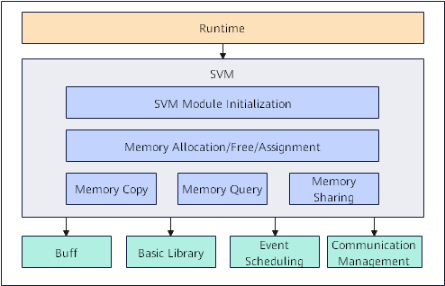
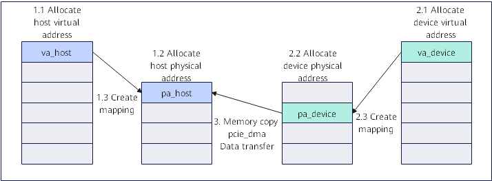
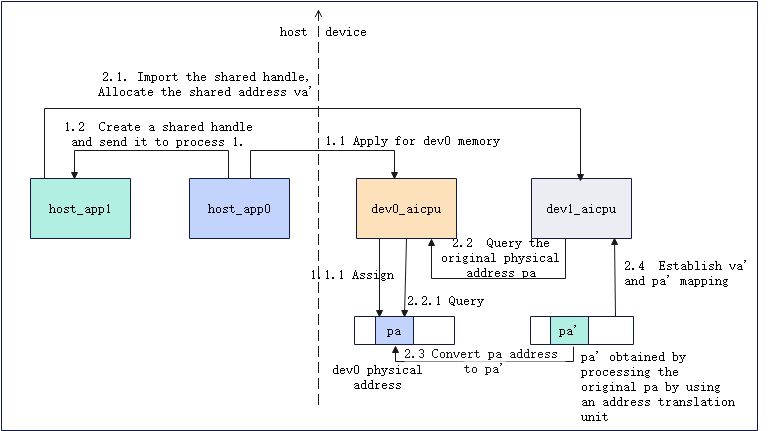
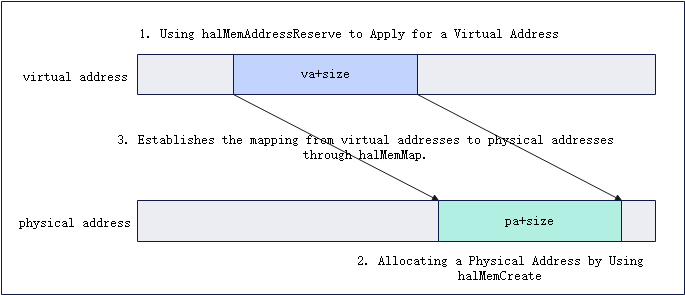
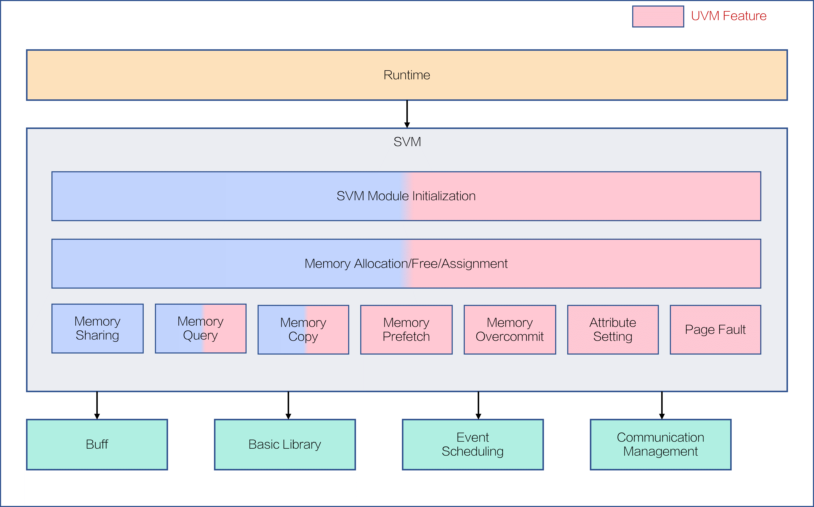
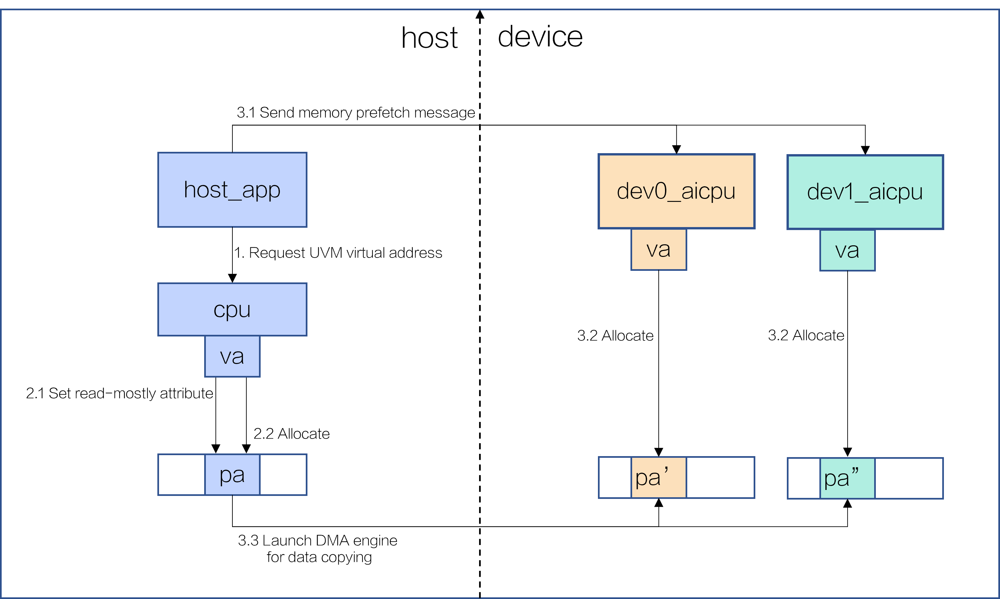
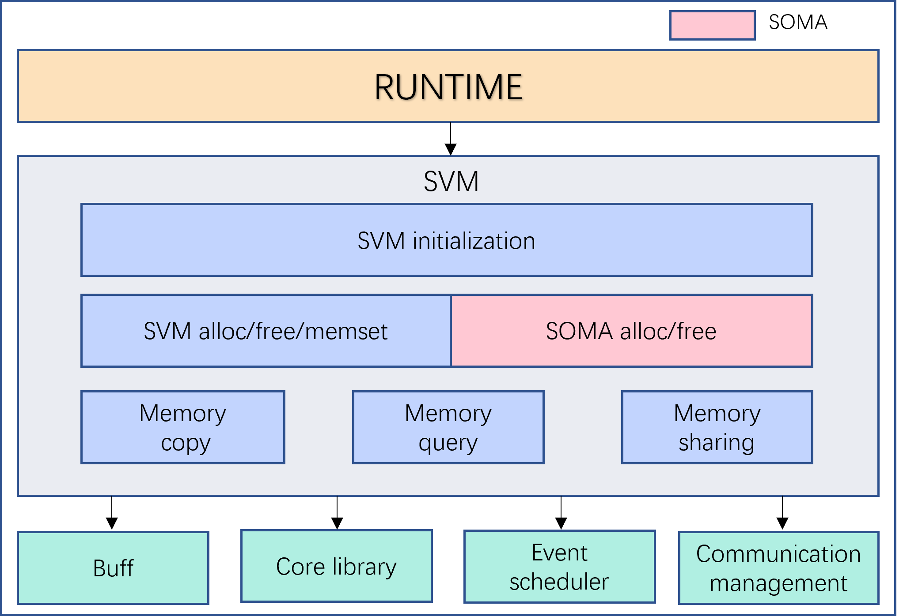
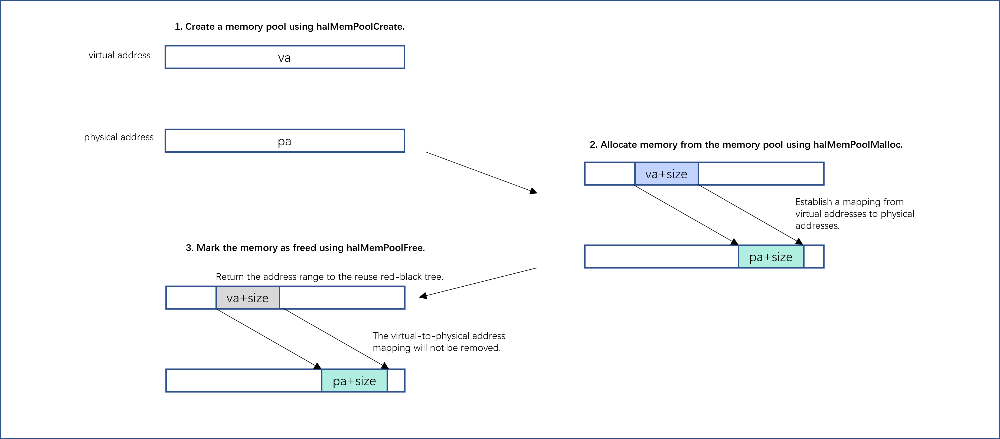

# SVM

## Overall Introduction

SVM (Shared Virtual Memory) is the memory management module in Ascend AI processor platform for efficient management of device-side memory. Its main functions include memory initialization, allocation, release, copy, query, sharing, and so on, and provides HAL interfaces to upper layer modules (such as Runtime).

<center>
    
</center>

## SVM Initialization

SVM Interface: ```halMemAgentOpen```
<br/>
APP process calls upper layer business initialization interface ```aclrtSetDevice``` during initialization, which includes SVM module initialization process. This process mainly includes: initializing SVM module management structure, and completing interaction between Host side and Device side SVM modules.

## Memory Allocation/Release/Assignment

SVM Interfaces: ```halMemAlloc```/```halMemFree```/```drvMemsetD8```
<br/>
Allocate and map (through ```mmap```) a virtual address segment from reserved virtual address range, meanwhile entering kernel mode to allocate physical pages, and establish corresponding page table entries. During release, sequentially unmap page table, release physical pages, and return virtual address to reserved range. Memory assignment sets specified size device memory to given value.

Additionally, driver provides VMM interfaces, allowing developers to separately allocate virtual addresses and physical addresses, and dynamically establish mapping relationships between them as needed.
<br/>

- VMM Virtual Address Allocation/Release
<br/>

SVM Interfaces: ```halMemAddressReserve```/```halMemAddressFree```
<br/>
Allocate and map (through ```mmap```) a virtual address segment from reserved address range, physical pages not actually allocated at this time; during release only reclaim that virtual address.

- VMM Physical Address Allocation/Release
<br/>

SVM Interfaces: ```halMemCreate```/```halMemRelease```
<br/>
Allocate specified attribute and size physical memory on device side, returning an opaque general memory allocation handle as reference identifier for subsequent memory mapping; during release, release physical memory corresponding to that handle.

- VMM Map/Unmap Virtual Address to Physical Address
<br/>

SVM Interfaces: ```halMemMap```/```halMemUnmap```
<br/>
Establish or remove mapping relationship between passed virtual address and physical address.

## Memory Query

Memory query supports memory attribute query and memory information query for specified address.

- Memory Attribute Query
<br/>

SVM Interface: ```drvMemGetAttribute```
<br/>
Get memory attributes, physical page granularity, and other attributes for passed virtual address.

- Memory Information Query
<br/>

SVM Interface: ```halMemGetInfo```
<br/>
Query device-side physical memory information.

## Memory Copy

SVM Interface: ```halMemcpy```
<br/>
Supports memory data transfer between host and device, or between different devices. For example, when executing H2D (Host-to-Device) transfer, data is synchronously copied from host memory to device memory. This synchronous copy operation is blocking - caller waits until all data copy completes before returning and continuing subsequent code execution.

## Memory Sharing

Memory sharing supports memory sharing between different devices, and memory sharing between Host and Device.

- Inter-Device Memory Sharing
<br/>

SVM Interfaces:
```halShmemCreateHandle```/```halShmemDestroyHandle```
<br/>
```halShmemOpenHandleByDevId```/```halShmemCloseHandle```
<br/>
Process 1 creates a handle pointing to shared device memory; Process 2 parses that handle, mapping it as device memory address within this process, thereby achieving shared access to same physical memory block on device side. Destroying handle and unmapping perform corresponding reverse operations respectively.

- Host and Device Memory Sharing
<br/>

SVM Interface: ```halHostRegister```/```halHostUnregister```
<br/>
Register corresponding memory of peer (Host side or Device side) to local side (Device side or Host side), enabling local side to directly access or modify data in peer memory.

## SVM Usage Process in Business

#### Allocation and Copy Function Business Usage Process

- Application Scenario
<br/>

Before operator runs, its Host side process needs to first initialize SVM module, then call ```halMemAlloc``` interface to separately allocate Host memory and Device memory, and get corresponding memory addresses; then through memory copy interface, transfer data to be calculated from Host side to Device side.

- Business Calling SVM Interface Process

1. Call ```halMemAlloc``` interface to allocate Host memory, get Host memory address.
2. Call ```halMemAlloc``` interface to allocate Device memory, get Device memory address.
3. Call ```halMemcpy``` interface to synchronously copy data from Host memory to Device memory, completing data transfer.

<center>
    
</center>

#### Memory Sharing Function Business Usage Process

- Application Scenario
<br/>

Business module starts two application processes on Host side: host_app process 0 and host_app process 1, corresponding to devices dev0 and dev1 respectively.
<br/>
During operator execution, dev0 writes completed calculation results to its local device memory. If subsequent calculation needs to be executed by dev1, dev1 can directly access dev0 calculation results through above shared memory mechanism without Host mediation or explicit data copy, thereby significantly improving operator pipeline execution efficiency.

- Business Calling SVM Interface Process

1. host_app process 0 calls ```halMemAlloc``` to allocate device memory on dev0, and creates shared handle for this memory through ```halShmemCreateHandle``` interface, then passes this handle to host_app process 1.
2. host_app process 1 calls driver interface ```halShmemOpenHandleByDevId``` to open this shared handle, driver returns pointer pointing to shared memory, thereby completing mapping to dev0 memory.

<center>
    
</center>

#### VMM Function Business Usage Process

- Application Scenario
<br/>

Based on VMM function, business module can one-time allocate required virtual addresses and physical addresses, and dynamically establish mapping relationships as needed, repeatedly using same physical memory block, thereby effectively reducing memory fragmentation caused by frequent physical memory splitting.

- Business Calling SVM Interface Process
<br/>

1. Call ```halMemAddressReserve``` to allocate virtual address.
2. Call ```halMemCreate``` to allocate physical address.
3. Call ```halMemMap``` to establish virtual address to physical address mapping.

<center>
    
</center>

# UVM

## Overall Introduction

UVM (Unified Virtual Memory) is Ascend AI processor memory management component, as functional enhancement of original SVM module, aiming to build unified address space across host side and device side, supporting transparent memory allocation and release logic.

Its core design principle is to shield physical storage medium differences: user program only needs to maintain single virtual address view, system based on access pattern implements data automatic or semi-automatic smooth migration between DDR (Double Data Rate) and HBM (High Bandwidth Memory), and supports zero-copy direct access.

UVM mainly focuses on three functional points:

- Ease of use: CPU and NPU can directly access unified memory without manually calling memory copy interfaces.
- Support card-side memory oversubscription: Through cold/hot identification and memory swap-out mechanism, break through single card physical memory limit, enabling single NPU to process ultra-large scale datasets.
- High performance: Support advance asynchronous data prefetch to target device, overlapping data access and transmission tasks, achieving pipeline parallelism.

<center>
    
</center>

## Usage Limitations
Currently only Ascend910B/Ascend910\_93 hardware form is supported.

## Memory Allocation Release

UVM Interfaces: halMemAlloc/halMemFree

Memory allocation and release interfaces reuse SVM interfaces to implement UVM unified virtual address management, core process follows:

When calling halMemAlloc with the MEM_UVM flag, it indicates allocating UVM memory.

- Delayed allocation: The system only reserves virtual address space and does not immediately trigger physical page allocation.
- On-demand addressing: Physical memory allocation deferred to first read/write access. At this time hardware triggers Page Fault, kernel dynamically allocates physical pages (supporting huge pages) and establishes page table mapping.
- Resource recycling: Calling halMemFree synchronously releases virtual address and physical address, cancels associated page table mapping, flushes TLB (Translation Lookaside Buffer).

## Memory Attribute Setting

UVM Interface: halMemManagedAdvise 

Supports setting or canceling specific attributes of a UVM memory segment to optimize data layout:

- READ_MOSTLY: Sets memory multi-copy attribute, commonly called read mostly attribute, suitable for read-more-write-less scenarios. This attribute creates read-only copies (virtual address sharing multiple physical copies) simultaneously on Host side and multiple Device sides, aiming to reduce performance overhead caused by page fault interrupts. Its advantage is except first access, each object access does not need to re-establish mapping; but cost is high, once write operation occurs, all copies except write object will invalidate and cancel this attribute. By default, setting this item ignores location parameter and establishes initial copy on Host side.
- UNSET_READ_MOSTLY: Cancels multi-copy attribute. System only retains copy at location specified position (if location invalid then defaults to retain Host side copy), and releases physical memory at other positions.
- PREFER_LOCATION: Sets memory preferred location attribute, commonly called preferred location attribute, indicates preferred location for accessing this memory segment is Host side or Device side, used to pre-allocate physical memory and establish page table mapping, thereby avoiding runtime page fault interrupts.
When setting preferred location attribute, need to note whether read mostly attribute is set:
  - When read mostly attribute not set: If already has mapping at preferred location then directly return; if already has mapping at non-preferred location then return error; if neither has mapping then allocate physical memory, establish readwrite attribute page table mapping then return.
  - When read mostly attribute already set: If setting preferred location on Host side, interface internally no operation needed directly return; if setting preferred location on specified Device side, interface internally checks whether specified Device side has copy, if yes, directly return, if no, establish read-only copy then return.
- UNSET_PREFER_LOCATION: Cancels setting preferred location position.
- ACCESS_BY_LOCATION: Sets remote mapping attribute, commonly called access by attribute, establishes remote mapping, indicates specified device will access this memory segment. This attribute needs to be used with preferred location attribute: when both specify same location, system will pre-allocate physical memory, establish page table mapping, thereby avoiding page fault interrupt overhead when accessing memory at preferred location. (Note: Currently A2/A3 architecture does not support establishing remote mapping).
- UNSET_ACCESS_BY_LOCATION: Cancels setting access by attribute.

## Page Fault Interrupt

UVM unified virtual memory core function is on-demand migration based on page interrupt. When CPU or NPU accesses unmapped or permission-restricted virtual address, system triggers page fault interrupt, through data transfer, page table rebuild and copy consistency maintenance, achieves cross-device address space unification.

- Host side page fault interrupt handling: Includes page faults caused by unmapped address access, and write operations to Host side pages in readmostly scenario.
- Device side page fault interrupt handling: Includes page faults caused by unmapped address access, and write operations to Device pages in readmostly scenario.

## Memory Oversubscription

UVM supports Device side memory oversubscription to cope with memory OOM (Out of Memory) risk, through swapping inactive pages to Host side, achieves logical memory capacity expansion. This mechanism includes two parts:

- Cold/hot identification:
    - Hardware marking: Uses Young Bit flag bit in page table entries. When AI CPU or AI Core accesses corresponding page, hardware automatically sets this bit to 1.
    - Software scanning: Device side kernel mode monitoring thread periodically performs read-after-clear operation on UVM memory page table entry Young Bits, achieving memory page cold/hot identification.
    - Dynamic grading: Combined with preset memory watermarks, system dynamically adjusts scanning frequency and hot threshold under different water pressure, achieving differentiated oversubscription strategy.

- Memory swap-out: Through DMA (Direct Memory Access) engine migrates identified cold data from Device side to pre-allocated Host side mapping area, releasing Device side memory.

## Memory Data Prefetch

UVM Interface: halMemManagedPrefetch

Explicitly prefetch data to target device:

- Reduce performance jitter: Avoid severe performance jitter caused by triggering large number of page fault interrupts on Device side.
- Pipeline parallelism: Combined with Runtime layer implements asynchronous prefetch interface. While Device side processes current batch data, asynchronously prefetch next batch data.
- Batch transmission: Compared to page-by-page transfer, large block data asynchronous prefetch can better saturate PCIe or UB bandwidth.

## UVM Usage Process in Business

#### Memory Prefetch Function Business Usage Process

- Application Scenario
<br/>

Based on UVM function, for read-more-write-less scenarios, such as needing to transfer large model weight parameters to multiple cards for parallel inference tasks, business module can allocate required virtual addresses, set Readmostly attribute, allocate physical memory and establish mapping on Host side, through memory prefetch transfer data to Device side.

- Business Calling UVM Interface Process
<br/>

1. Call ```halMemAlloc``` interface to allocate Host side virtual memory, get Host side virtual memory address.
2. Call ```halMemManagedAdvise``` interface to set READ_MOSTLY attribute, allocate physical memory and establish page table mapping.
3. Call ```halMemManagedPrefetch``` interface to trigger prefetch task, migrate data from Host side to Device side.

- UVM Interface Call Process Implementation Example
<br/>

[UVM Test File](../../../examples/resmng/uvm/developer_demo/uvm_main.c)
<br/>
Business process test function: st_uvm_test_002

<center>
    
</center>

# SOMA

## Overall Introduction

SOMA (Stream-Oriented Memory Allocator) is a stream-based asynchronous memory management submodule under the SVM (Shared Virtual Memory) module, used to efficiently manage device-side memory resources in stream-oriented execution scenarios. Its main functions include memory pool creation and destruction, asynchronous memory allocation and release, memory pool attribute setting and querying, and so on, and provides high-performance, low-overhead asynchronous memory management capabilities to upper layer modules (such as Runtime).

<center>
    
</center>

## Usage Limitations
- The SOMA feature cannot be enabled by calling HAL interfaces from the host side. It can only be enabled through Runtime ACL interfaces. For usage examples, refer to [SOMA Runtime example](https://gitcode.com/cann/runtime/blob/master/example/3_memory_advanced/memory_pool).
- Currently only Ascend950 PCIE hardware form is supported.

## Memory Pool Creation and Destruction

SOMA Interfaces: `halMemPoolCreate` / `halMemPoolDestroy`

Call `halMemPoolCreate` to create a memory pool management structure on the device. This structure manages subsequent asynchronous memory allocation and release. When creating a memory pool, you can set the pool ID, maximum capacity, and other parameters, but no physical memory is allocated immediately.

Call `halMemPoolDestroy` to destroy a specified memory pool management structure. This ensures that all memory blocks allocated by the pool are properly released and that related resources are returned to the system, thereby avoiding memory leaks.

## Asynchronous Memory Allocation/Release

SOMA Interfaces: `halMemPoolMalloc` / `halMemPoolFree`

`halMemPoolMalloc` is a memory allocation interface provided on the device side for AI CPU to call. It allocates a segment of device memory from a specified memory pool. When calling this interface, specify the target memory pool, virtual address, allocation size, and memory allocation strategy. The function allocates physical pages based on the memory pool management structure and establishes the corresponding page table mapping, so that the allocated memory can be directly used for subsequent computation.

`halMemPoolFree` returns a segment of device memory to the memory pool. When calling this interface, specify the target memory pool, virtual address, release size, and release strategy. The released memory is not immediately returned to the operating system. Instead, it remains in the memory pool for subsequent reuse, which improves memory utilization and allocation efficiency.

## Memory Pool Attribute Setting and Querying

SOMA Interfaces: `halMemPoolSetAttr` / `halMemPoolGetAttr`

Call `halMemPoolSetAttr` to set memory pool attributes, such as the memory pool watermark value. When calling this interface, specify the target memory pool and attribute key-value pairs.

Call `halMemPoolGetAttr` to query the current attribute values of the memory pool. When calling this interface, specify the target memory pool and attribute key, and the corresponding attribute value is returned.

## SOMA Usage Process in Business

#### Memory Pool Asynchronous Allocation and Release Business Usage Process

- **Application Scenario**

<br/>

During AI model training or inference, multiple operators execute in parallel across different streams and frequently allocate and release device memory. If physical pages are requested from the system each time, significant overhead and fragmentation occur. SOMA uses memory pools and asynchronous mechanisms to make memory allocation and release efficient, thereby improving pipeline execution performance.

- **Business Calling SOMA Interface Process**

1. Initialize the memory pool. Call `halMemPoolCreate` to create the memory pool management structure.
2. Before operator execution, call `halMemPoolMalloc` to asynchronously allocate device memory and obtain the virtual address.
3. After the operator completes computation, call `halMemPoolFree` to return the device memory to the memory pool and release resources.

<center>
    
</center>
